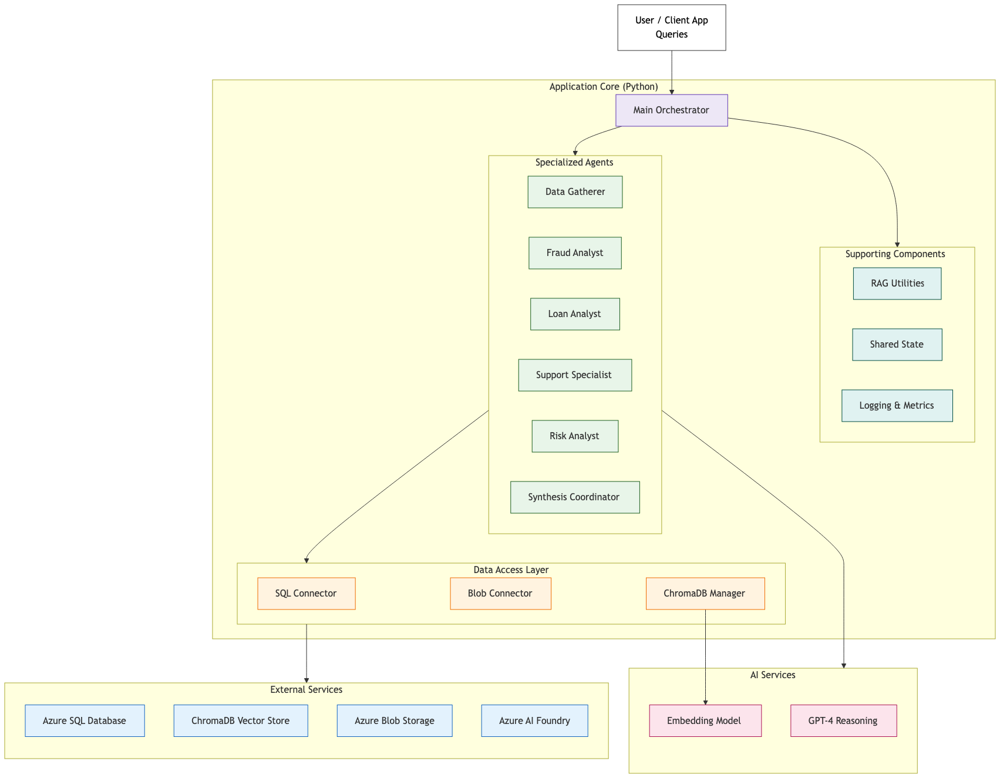
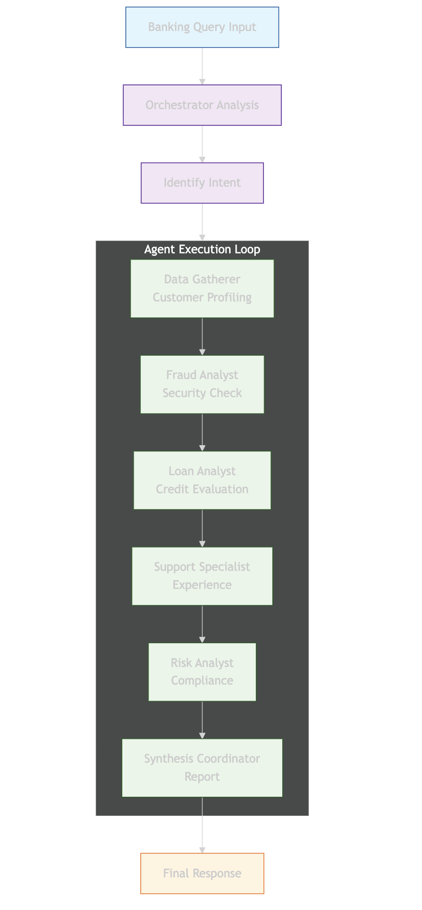
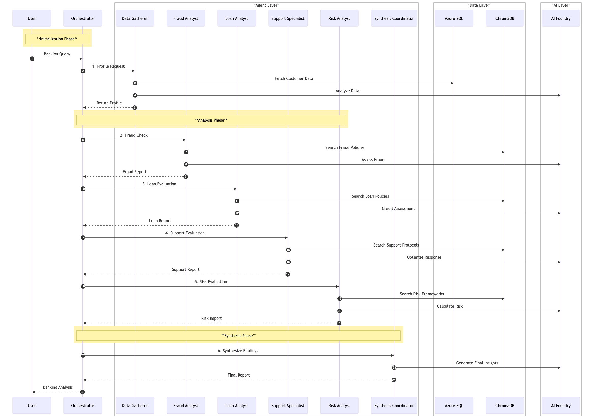

# VectraBank: Agentic RAG for Banking

A multi-agent AI system for comprehensive banking analysis, built with Microsoft Semantic Kernel and Retrieval Augmented Generation (RAG). The system orchestrates six specialized agents to process customer queries across fraud detection, loan eligibility, customer support, risk assessment, and strategic planning.

---

## System Architecture

The system follows a layered architecture connecting user queries through a central orchestrator to specialized agents, data services, and AI models.



**Key layers:**
- **Application Core** -- Main orchestrator (`main_starter.py`) manages the workflow
- **Specialized Agents** -- Six domain-expert agents powered by Azure AI Foundry (GPT-4.1)
- **Data Access Layer** -- SQL Connector, Blob Connector, and ChromaDB Manager
- **External Services** -- Azure SQL Database, Azure Blob Storage, ChromaDB Vector Store, Azure AI Foundry

---

## Agent Orchestration

Agents execute in a sequential pipeline using Semantic Kernel's `SequentialOrchestration`. Each agent builds on the previous agent's output, culminating in a synthesized executive report.



| # | Agent | Role |
|---|-------|------|
| 1 | **Data Gatherer** | Customer profiling, financial metrics, policy matching |
| 2 | **Fraud Analyst** | Transaction pattern analysis, suspicious activity detection |
| 3 | **Loan Analyst** | Credit risk evaluation, eligibility determination |
| 4 | **Support Specialist** | Customer experience assessment, retention strategies |
| 5 | **Risk Analyst** | Multi-dimensional risk scoring, compliance verification |
| 6 | **Synthesis Coordinator** | Executive report generation, strategic recommendations |

---

## Data Flow

The sequence diagram below shows the complete data flow from user query to final report, including interactions with Azure SQL, ChromaDB, and Azure AI Foundry.



**Three phases:**
1. **Initialization** -- Load customer profile from Azure SQL, fetch transaction data
2. **Analysis** -- Each agent queries ChromaDB for relevant policies and calls Azure AI Foundry for reasoning
3. **Synthesis** -- Coordinator integrates all findings into a structured `EnhancedBankingReport`

---

## Project Structure

```
banking-agenttt/
|-- start.sh                     # Launcher for macOS/Linux (dev or prod)
|-- start.bat / start.ps1        # Launcher for Windows (dev or prod)
|-- backend/
|   |-- api.py                   # FastAPI web API (REST + SSE streaming), serves built frontend
|   |-- main_starter.py          # Orchestration engine + CLI entry point
|   |-- offline_agents.py        # Rule-based agents used when no LLM keys are configured
|   |-- blob_connector.py        # Document storage (local simulation of Azure Blob)
|   |-- chroma_manager.py        # ChromaDB vector database manager (6 collections)
|   |-- rag_utils.py             # PDF/DOCX/TXT reading, chunking, policy extraction
|   |-- shared_state.py          # Thread-safe state management between agents
|   |-- banking_documents/       # Policy documents ingested into ChromaDB
|   |-- create.sql / insert.sql  # Azure SQL schema + sample data
|   |-- requirements.txt / pyproject.toml
|   |-- .env.example             # Copy to .env and add credentials
|-- frontend/                    # React + Vite web UI
|   |-- src/App.jsx              # Tabs: Analysis, Knowledge Base, Reports, System
|   |-- src/components/          # Live agent pipeline, report view, RAG search, ...
|-- static/                      # Architecture diagrams
|-- REFLECTION_REPORT.md
```

---

## Tech Stack

| Component | Technology |
|-----------|-----------|
| Agent Framework | Microsoft Semantic Kernel (`SequentialOrchestration`) |
| LLM | Azure AI Foundry -- GPT-4.1 |
| Embeddings | Azure text-embedding-3-small |
| Vector Database | ChromaDB (6 banking-specific collections) |
| Relational Database | Azure SQL Database |
| Document Storage | Local file system (Azure Blob simulation) |
| Data Validation | Pydantic with field validators |
| Language | Python 3.11+ |

---

## Prerequisites

- Python 3.11+
- Node.js 18+
- Optional: Azure AI Foundry deployment (GPT-4.1) **or** an OpenAI API key
- Optional: Azure SQL Database (needs `pip install pyodbc` + unixODBC)

---

## Quick Start

**macOS / Linux**

```bash
./start.sh          # backend on :8000 + frontend dev server on :5173
./start.sh prod     # builds the frontend and serves everything from :8000
```

**Windows (PowerShell or Command Prompt)**

```powershell
.\start.bat         # backend opens in a new window on :8000, frontend on :5173
.\start.bat prod    # builds the frontend and serves everything from :8000
```

`start.bat` runs `start.ps1` with the execution policy bypassed, so you don't need to change system settings.

Then open http://localhost:5173 (dev) or http://localhost:8000 (prod). API docs: http://localhost:8000/docs

### Manual setup

```bash
# Backend
cd backend
python3 -m venv .venv && source .venv/bin/activate
pip install -r requirements.txt
cp .env.example .env            # optionally add LLM credentials
uvicorn api:app --reload --port 8000

# Frontend (new terminal)
cd frontend
npm install
npm run dev                     # proxies /api to http://localhost:8000
```

### LLM modes

The backend picks a provider automatically (override with `LLM_MODE=azure|openai|offline`):

| Mode | When | Agents powered by |
|------|------|-------------------|
| `azure` | `AZURE_TEXTGENERATOR_DEPLOYMENT_*` set | Semantic Kernel `SequentialOrchestration` + Azure AI Foundry |
| `openai` | `OPENAI_API_KEY` set | Semantic Kernel `SequentialOrchestration` + OpenAI (`OPENAI_MODEL`) |
| `offline` | no credentials | Deterministic, policy-grounded rule-based agents (same RAG + pipeline) |

The system falls back to sample customer data if Azure SQL is unavailable.

---

## Web UI

- **Analysis** -- pick a customer, enter a query, watch the six agents run live (Server-Sent Events), read each agent's output and the executive report (risk gauge, findings, recommendations, policy references), download as JSON
- **Knowledge Base** -- browse the policy documents and run hybrid RAG searches across collections
- **Reports** -- history of generated reports; reopen any report
- **System** -- LLM provider, ChromaDB collection stats, runtime metrics

## REST API

| Method | Path | Description |
|--------|------|-------------|
| GET | `/api/health` | Status, LLM mode, document/chunk counts |
| GET | `/api/customers` | Customer profiles with computed risk |
| GET | `/api/customers/{id}` | Single profile + interaction history |
| GET | `/api/documents` / `/api/documents/{name}` | Policy documents |
| POST | `/api/search` | Hybrid RAG search `{query, collections?, top_k}` |
| POST | `/api/analyze` | Run analysis `{customer_id, query}` -> report |
| POST | `/api/analyze/stream` | Same, streamed as SSE progress events |
| GET | `/api/reports` / `/api/reports/{id}` | Generated reports |
| GET | `/api/metrics` | Runtime and collection metrics |

## CLI

```bash
cd backend
python main_starter.py --all    # component tests + all 3 scenarios
python main_starter.py --demo   # single demo scenario
python main_starter.py --test   # all scenarios with validation
```

---

## Test Results

The system includes 29 component-level tests and 3 end-to-end scenario validations:

```
COMPONENT TESTS: 29/29 passed

VALIDATION SUMMARY:
  [PASS] Customer 12345: agents=6/6, risk=0.070 (low),       time=31.2s
  [PASS] Customer 67890: agents=6/6, risk=0.470 (medium-low), time=23.1s
  [PASS] Customer 11111: agents=6/6, risk=0.750 (high),       time=46.7s

Overall: ALL PASSED
```

**Test scenarios:**

| Customer | Query Type | Risk Profile |
|----------|-----------|--------------|
| 12345 | Financial planning & investments | Low risk -- $75K income, 780 credit score, 5 products |
| 67890 | Home loan eligibility | Medium risk -- $45K income, 680 credit score |
| 11111 | Suspicious account activity | High risk -- $28K income, 620 credit score, 1 product |

---

## RAG Pipeline

1. **Document Ingestion** -- `BlobStorageConnector` loads 5 banking policy documents (fraud, loans, support, risk, transactions)
2. **Text Extraction** -- `rag_utils.read_document_file()` reads PDF, DOCX, and Markdown formats
3. **Chunking** -- Documents are split into overlapping chunks at paragraph boundaries
4. **Embedding & Storage** -- Chunks are embedded and stored in 6 ChromaDB collections
5. **Hybrid Search** -- Combines semantic similarity with keyword boosting for retrieval
6. **Context Injection** -- Retrieved policies are injected into agent prompts for grounded reasoning

---

## Risk Scoring

The `_calculate_enhanced_risk_score()` method evaluates five dimensions:

| Factor | Low Risk | High Risk |
|--------|----------|-----------|
| Income | >= $100K (-0.15) | < $30K (+0.10) |
| Credit Score | >= 750 (-0.15) | < 650 (+0.15) |
| Customer Tenure | >= 5 years (-0.10) | < 1 year (+0.08) |
| Product Diversification | >= 4 products (-0.08) | <= 1 product (+0.05) |
| Transaction Patterns | Normal | Max > $10K (+0.10) |

Score is normalized to [0.0, 1.0] and mapped to tiers: low, medium-low, medium, high, critical.

---

## Sample Output

```
FINAL REPORT: enhanced_a1b2c3d4
Customer: 12345
Risk Assessment: low (score: 0.070)

Key Findings:
  - Customer qualifies for Tier A+ or A lending products (income: $75,000.00)
  - Excellent credit score (780) - eligible for best rates (3.5% APR)
  - High product engagement (5 products) indicates strong customer relationship

Recommendations:
  - Continue standard monitoring with annual reviews
  - Schedule periodic financial health review to identify emerging opportunities

Policy References: fraud_detection_policy_v2.md, loan_eligibility_framework.md, ...
Agent Contributions: [Data_Gatherer, Fraud_Analyst, Loan_Analyst, Support_Specialist, Risk_Analyst, Synthesis_Coordinator]
```

---

## Documentation

- [REFLECTION_REPORT.md](REFLECTION_REPORT.md) -- Architecture decisions, challenges, and improvement suggestions
- Inline docstrings throughout all Python modules
- Structured logging to `backend/logs/banking_analysis_<timestamp>.log` (CLI) and stdout (API)
